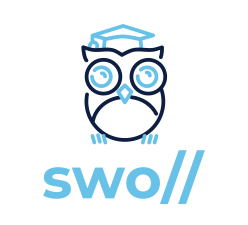
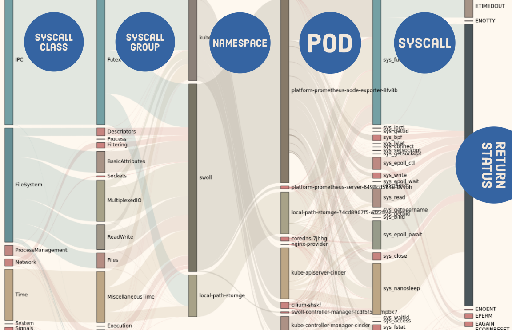

[](https://drone.cstack.co/criticalstack/swoll)

 

# Introduction

Swoll is an experimental suite of applications and APIs for monitoring kernel-level activity on a
kubernetes cluster; most of which is written in the Golang programming language, strewn about with 
bits and bobs of C and Yaml. 

Using simple counters and minimal state, Swoll has the ability to report on a
wide bevy of information pertaining to system calls being made by or from a
container running inside a Kubernetes cluster. Each individual metric for both
timing and counting contains the following information:

* Syscall
  - Return Status
  - Classification
  - Group
* Kubernetes information
  - Namespace
  - Pod
  - Container

Since data is aggregated in this manner, every call, every error, for every
container, running in every pod is accounted for. One can query for the count of
calls to the function `openat` made by a container in the pod `coredns`, within the 
`kube-system` namespace which resulted in a "No such file or directory" error (ENOENT).

By default, this data is exported in `Prometheus` format on each running
instance at the URI `/metrics`. More detailed chart examples (powered by
echarts) can be seen at the URI `/metrics/charts`.


**Example charts output**

_The above Sankey diagram displays the distribution of system calls in an interesting™ manner._


**Prometheus query examples** 
```sh
$ promtool query instant https://prometheus.local '
  sort_desc(
   sum(
    swoll_node_metrics_syscall_count{
     namespace="kube-system"
    }) by (err))'

{err="ETIMEDOUT"}       => 745430
{err="EAGAIN"}          => 254506
{err="EINPROGRESS"}     => 2217
{err="EPERM"}           => 1779
{err="ENOENT"}          => 1288
{err="EPROTONOSUPPORT"} => 60
{err="EINTR"}           => 46
```
_Total count of syscalls grouped by the return-status originating from the kubernetes namespace `kube-system`_

```sh
$ promtool query instant https://prometheus.local '
  sort_desc(
   sum(
    swoll_node_metrics_syscall_count{
     namespace="kube-system",
     syscall="sys_openat"
    }) by (namespace,pod))'

{namespace="kube-system", pod="kube-proxy-27xrc"}                 => 1260
{namespace="kube-system", pod="cilium-shskf"}                     => 670
{namespace="kube-system", pod="kube-apiserver-cinder"}            => 471
{namespace="kube-system", pod="coredns-7jhhg"}                    => 297
{namespace="kube-system", pod="kube-controller-manager-cinder"}   => 191
{namespace="kube-system", pod="cilium-operator-657978fb5b-cjx72"} => 78
```
_Count all calls to the function `sys_openat` grouped by kubernetes Pod, and Namespace_

```sh
$ promtool query instant https://prometheus.local '
  sort_desc(
   avg by (container, pod, namespace, syscall) (
    rate(
     swoll_node_metrics_syscall_count { err != "OK" }[5m]
     offset 5m
    )) /
   avg by (container, pod, namespace, syscall) (
    rate(
     swoll_node_metrics_syscall_count{ err != "OK" }[5m]
    )
   ))'
{container="operator", namespace="kube-system", pod="cilium-operator", syscall="sys_epoll_ctl"} => 2.0
{container="coredns",  namespace="kube-system", pod="coredns-7jhhg",   syscall="sys_futex"}     => 1.1
{container="operator", namespace="kube-system", pod="cilium-operator", syscall="sys_read"}      => 1.0
{container="agent",    namespace="kube-system", pod="cilium-shskf",    syscall="sys_futex"}     => 1.0
```
_Query the relative change in the rate of calls that incurred an error compared to the previous 5 minutes grouped by container, pod, namespace, and syscall_ 

---

While metrics by themselves are great and all, `swoll` also provides a
kubernetes-native interface for creating, collecting, and presenting detailed
realtime logs of system activity. 

Take the following Trace configuration as an example:

```yaml
apiVersion: tools.swoll.criticalstack.com/v1alpha1
kind: Trace
metadata:
  name: trace-nginx-hosts
  namespace: swoll
spec:
  syscalls:
    - connect
    - accept4
    - bind
    - listen
    - execve
    - openat
  labelSelector:
      matchLabels:
          app: "nginx"
  fieldSelector:
      matchLabels:
          status.phase: "Running"
```

When applied, `swoll` will start tracing the system-calls `connect`, `accept4`,
`bind`, `listen`, `execve`, and `openat` for any containers that match the
pod-label `app=nginx`, and the field-label `status.phase=Running` (match only
running containers). 

Once started the raw events are written in JSON format and can be seen via
`kubectl logs`:

```sh
$ kubectl logs -l sw-job=trace-nginx-hosts -n swoll | head -n 1 | jq .
```

```json
{
  "payload": {
    "syscall": {
      "nr": 257,
      "name": "sys_openat",
      "class": "FileSystem",
      "group": "Files"
    },
    "pid": 3797092,
    "tid": 3797092,
    "uid": 0,
    "gid": 0,
    "comm": "sh",
    "session": 1,
    "container": {
      "id": "13765a70dfbb1b35ebff60c04ddfebf9177715bcf79e67279d4e8128799501bf",
      "pod": "nginx-provider",
      "name": "indexwriter",
      "image": "sha256:1510e850178318cd2b654439b56266e7b6cbff36f95f343f662c708cd51d0610",
      "namespace": "swoll",
      "labels": {
        "io.kubernetes.container.name": "indexwriter",
        "io.kubernetes.pod.name": "nginx-provider",
        "io.kubernetes.pod.namespace": "swoll",
        "io.kubernetes.pod.uid": "4c16fc49-2c47-427d-b5d6-a222e65b76c9"
      },
      "pid": 408510,
      "pid-namespace": 4026535150
    },
    "error": "OK",
    "return": 3,
    "pid_ns": 4026535150,
    "uts_ns": 4026535144,
    "mount_ns": 4026535149,
    "start": 529490506498247,
    "finish": 529490506535997,
    "args": {
      "dir_fd": -100,
      "pathname": "/html/index․html",
      "flags": [
        "O_CREAT",
        "O_APPEND",
        "O_WRONLY"
      ]
    }
  }
}
```


_A sweet gif showing commands being run... So 2020_


---

## Using the API to trace.

### Local, without Kubernetes resolution

In this example we display how to utilize the `swoll` Golang API to initiate a
local trace of the `execve` call without Kubernetes locally. This assumes you
have compiled the bpf object and it is located in `internal/bpf/probe.o`.

```go
package main

import (
    "bytes"
    "context"
    "fmt"
    "io/ioutil"

    "github.com/criticalstack/swoll/pkg/event"
    "github.com/criticalstack/swoll/pkg/event/call"
    "github.com/criticalstack/swoll/pkg/event/reader"
    "github.com/criticalstack/swoll/pkg/kernel"
    "github.com/criticalstack/swoll/pkg/kernel/filter"
)

func main() {
    // read local bpf object
    bpf, _ := ioutil.ReadFile("internal/bpf/probe.o")
    // create a probe object
    probe, _ := kernel.NewProbe(bytes.NewReader(bpf), nil)

    // initialize the underlying bpf tables
    probe.InitProbe()

    // create a new kernel-filter bound to the current bpf probe
    filt, _ := filter.NewFilter(probe.Module())
    // inform the probe we are interested in all execve
    filt.AddSyscall("execve", -1)

    // create an event reader for the probe
    reader := reader.NewEventReader(probe)
    // run the probe
    go reader.Run(context.Background())

    // where to store decoded events
    decoded := new(event.TraceEvent)

    for {
        // read a single message from the event queue from the kernel
        msg := <-reader.Read()
        // convert the raw data from the kernel into a proper TraceEvent object
        decoded.Ingest(msg)

        // fetch the arguments associated with the call
        args := decoded.Argv.(call.Function).Arguments()

        fmt.Printf("comm:%-15s pid:%-8d %s(%s)\n", decoded.Comm, decoded.Pid, decoded.Syscall, args)
    }
}
```

### Local, With Kubernetes

The easiest way to trace kubernetes is to utilize the `Topology` API which
consists of an `Observer`, and a `Hub`. A `Hub` is an abstraction around kernel
filtering based on events sourced from the `Observer`. In this case, we will
utilize a Kubernetes `Observer` which emits container-ready events for any POD
events.

```go
package main

import (
    "context"
    "fmt"
    "io/ioutil"
    "os"
    "path/filepath"

    "github.com/criticalstack/swoll/api/v1alpha1"
    "github.com/criticalstack/swoll/internal/pkg/hub"
    "github.com/criticalstack/swoll/pkg/event"
    "github.com/criticalstack/swoll/pkg/event/call"
    "github.com/criticalstack/swoll/pkg/topology"
)

func main() {
    // read local bpf object
    bpf, _ := ioutil.ReadFile("internal/bpf/probe.o")
    kConfig := os.Getenv("HOME") + "/.kube/config"
    rootDir := "/proc/3796667/root"
    criSock := "/run/containerd/containerd.sock"

    kTopo, _ := topology.NewKubernetes(
        topology.WithKubernetesCRI(filepath.Join(rootDir, criSock)),
        topology.WithKubernetesConfig(kConfig),
        topology.WithKubernetesProcRoot(rootDir))

    kHub, _ := hub.NewHub(&hub.Config{
        AltRoot:     rootDir,
        BPFObject:   bpf,
        CRIEndpoint: filepath.Join(rootDir, criSock),
        K8SEndpoint: kConfig}, kTopo)

    go kHub.Run(context.Background())

    trace := &v1alpha1.Trace{
        Spec: v1alpha1.TraceSpec{
            Syscalls: []string{"execve"},
        },
        Status: v1alpha1.TraceStatus{
            JobID: "trace-nginx",
        },
    }

    go kHub.Run(context.Background())
    go kHub.RunTrace(trace)

    kHub.AttachTrace(trace, func(id string, ev *event.TraceEvent) {
        args := ev.Argv.(call.Function).Arguments()

        fmt.Printf("container=%s pod=%s namespace=%s comm:%-15s pid:%-8d %s(%s)\n",
            ev.Container.Name, ev.Container.Pod, ev.Container.Namespace,
            ev.Comm, ev.Pid, ev.Syscall, args)
    })

    select {}

}
```


## swoll-trace
## swoll-server
## swoll-controller
## swoll-client

*Monitor. Consume. React.*

Kernel
  - filtering
  - collection
  - distribution
  - metrics
Userland
  - collection
  - translation
  - presentation


# Installation

See [BUILD INSTRUCTIONS](BUILDING.md)

# Usage

TODO

## Contributing
Any contributors must accept and [sign the CLA](https://cla-assistant.io/criticalstack/swoll).
This project has adopted the [Capital One Open Source Code of conduct](https://developer.capitalone.com/resources/code-of-conduct).
