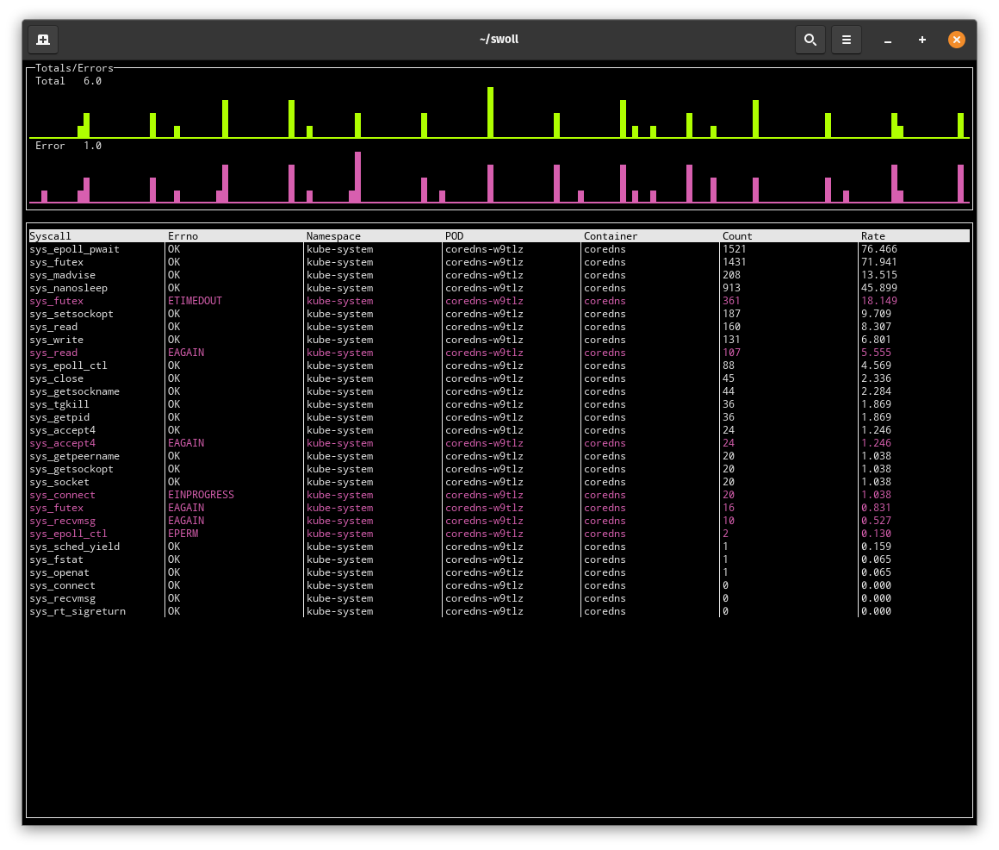

<p align="center">
  
</p>

# QUICK

Just wanna test things out? Here is an example command to run that doesn't require k8s.

```
docker run --rm -it --pid=host --privileged criticalstack/swoll:latest trace --no-containers -s execve,openat
```

# Introduction

Swoll is an **experimental** suite of applications and APIs for monitoring kernel-level activity on a live Kubernetes cluster, mostly written in the Golang programming language, strewn about with bits and bobs of C and Yaml. 

Using simple counters and a minimal state, Swoll can report on a wide bevy of information on system calls being made by or from a container running inside a Kubernetes cluster. Each metric for both timing and counting contains the following information:

* Syscall
  - Return Status
  - Classification
  - Group
* Kubernetes information
  - Namespace
  - Pod
  - Container

Aggregating data in this manner allows a user to monitor every call and its resulting return status for every container in every Kubernetes Pod. For example, one can query the total count of calls to the function `sys_openat` sourced from a specific container in the pod `coredns` in the namespace `kube-system` that resulted in a "No such file or directory" error.

Metrics are exposed via the URI `/metrics` in `Prometheus` format, along with detailed charting examples (powered by e-charts) at the URI `/metrics/charts`.

**Example charts output**

_The above Sankey diagram displays the distribution of system calls in an attractive™ manner._

**Example swoll top output**


**Prometheus query examples** 
```sh
$ promtool query instant https://prometheus.local '
  sort_desc(
   sum(
    swoll_node_metrics_syscall_count{
     namespace="kube-system"
    }) by (err))'

{err="ETIMEDOUT"}       => 745430
{err="EAGAIN"}          => 254506
{err="EINPROGRESS"}     => 2217
{err="EPERM"}           => 1779
{err="ENOENT"}          => 1288
{err="EPROTONOSUPPORT"} => 60
{err="EINTR"}           => 46
```
_Total count of syscalls grouped by the return-status originating from the Kubernetes namespace `kube-system`_

```sh
$ promtool query instant https://prometheus.local '
  sort_desc(
   sum(
    swoll_node_metrics_syscall_count{
     namespace="kube-system",
     syscall="sys_openat"
    }) by (namespace,pod))'

{namespace="kube-system", pod="kube-proxy-27xrc"}                 => 1260
{namespace="kube-system", pod="cilium-shskf"}                     => 670
{namespace="kube-system", pod="kube-apiserver-cinder"}            => 471
{namespace="kube-system", pod="coredns-7jhhg"}                    => 297
{namespace="kube-system", pod="kube-controller-manager-cinder"}   => 191
{namespace="kube-system", pod="cilium-operator-657978fb5b-cjx72"} => 78
```
_Count all calls to the function `sys_openat` grouped by Kubernetes Pod, and namespace_

```sh
$ promtool query instant https://prometheus.local '
  sort_desc(
   avg by (container, pod, namespace, syscall) (
    rate(
     swoll_node_metrics_syscall_count { err != "OK" }[5m]
     offset 5m
    )) /
   avg by (container, pod, namespace, syscall) (
    rate(
     swoll_node_metrics_syscall_count{ err != "OK" }[5m]
    )
   ))'
{container="operator", namespace="kube-system", pod="cilium-operator", syscall="sys_epoll_ctl"} => 2.0
{container="coredns",  namespace="kube-system", pod="coredns-7jhhg",   syscall="sys_futex"}     => 1.1
{container="operator", namespace="kube-system", pod="cilium-operator", syscall="sys_read"}      => 1.0
{container="agent",    namespace="kube-system", pod="cilium-shskf",    syscall="sys_futex"}     => 1.0
```
_Query the relative change in the rate of calls that incurred an error compared to the previous 5 minutes grouped by container, Pod, namespace, and syscall_ 

---

While metrics by themselves are great and all, `swoll` also provides a
Kubernetes-native interface for creating, collecting, and presenting detailed
real-time logs of system activity. 

Take the following Trace configuration as an example:

```yaml
apiVersion: tools.swoll.criticalstack.com/v1alpha1
kind: Trace
metadata:
  name: trace-nginx-hosts
  namespace: swoll
spec:
  syscalls:
    - connect
    - accept4
    - bind
    - listen
    - execve
    - openat
  labelSelector:
      matchLabels:
          app: "nginx"
  fieldSelector:
      matchLabels:
          status.phase: "Running"
```

When applied, `swoll` will start tracing the system-calls `connect`, `accept4`, `bind`, `listen`, `execve`, and `openat` for any containers that match the pod-label `app=nginx`, and the field-label `status.phase=Running` (match only running containers). 

Once started, the raw JSON events are retrieved via `kubectl logs`:

```sh
$ kubectl logs -l sw-job=trace-nginx-hosts -n swoll | head -n 1 | jq .
```

```json
{
  "payload": {
    "syscall": {
      "nr": 257,
      "name": "sys_openat",
      "class": "FileSystem",
      "group": "Files"
    },
    "pid": 3797092,
    "tid": 3797092,
    "uid": 0,
    "gid": 0,
    "comm": "sh",
    "session": 1,
    "container": {
      "id": "13765a70dfbb1b35ebff60c04ddfebf9177715bcf79e67279d4e8128799501bf",
      "pod": "nginx-provider",
      "name": "indexwriter",
      "image": "sha256:1510e850178318cd2b654439b56266e7b6cbff36f95f343f662c708cd51d0610",
      "namespace": "swoll",
      "labels": {
        "io.kubernetes.container.name": "indexwriter",
        "io.kubernetes.pod.name": "nginx-provider",
        "io.kubernetes.pod.namespace": "swoll",
        "io.kubernetes.pod.uid": "4c16fc49-2c47-427d-b5d6-a222e65b76c9"
      },
      "pid": 408510,
      "pid-namespace": 4026535150
    },
    "error": "OK",
    "return": 3,
    "pid_ns": 4026535150,
    "uts_ns": 4026535144,
    "mount_ns": 4026535149,
    "start": 529490506498247,
    "finish": 529490506535997,
    "args": {
      "dir_fd": -100,
      "pathname": "/html/index․html",
      "flags": [
        "O_CREAT",
        "O_APPEND",
        "O_WRONLY"
      ]
    }
  }
}
```


_A sweet gif showing a trace running... So 2020_


---

# API 

TBD, for now, see: `examples/'

# Building

See [BUILD INSTRUCTIONS](BUILDING.md)


## Contributing
Any contributors must accept and [sign the CLA](https://cla-assistant.io/criticalstack/swoll).
This project has adopted the [Capital One Open Source Code of conduct](https://developer.capitalone.com/resources/code-of-conduct).
